<picture>
  <source media="(prefers-color-scheme: dark)" srcset="hero.svg">
  
</picture>

# bench-notes

Short, opinionated notes on benchmark methodology — one failure mode per note, each with a claim, a failure example, evidence, and the counter-case where the advice inverts.

Written after watching our own numbers lie to us, in both directions.

## The notes

| Note | The failure it prevents |
|---|---|
| [median-over-mean](notes/median-over-mean.md) | a single 40 ms hiccup becoming your headline number |
| [warmup-and-jit](notes/warmup-and-jit.md) | measuring the JIT compiler and calling it your kernel |
| [checksum-anti-dce](notes/checksum-anti-dce.md) | timing an empty loop the optimizer left behind |
| [ffi-boundary-crossover](notes/ffi-boundary-crossover.md) | "WASM is faster" at exactly one workload size |
| [publish-the-negative](notes/publish-the-negative.md) | a wins-only table nobody can believe |
| [ci-is-a-detector-not-a-ruler](notes/ci-is-a-detector-not-a-ruler.md) | publishing CI-runner noise as a performance claim |

## House rules

- Every note carries a **failure example** — advice without a way it goes wrong is a slogan.
- Every note carries a **counter-note** — the condition under which the advice inverts. Methodology without inversion conditions is dogma.
- Numbers quoted from real projects link to the public artifact they came from, with machine, runtime and profile in the caption.

---

Orvii — Open, Research, Vision, Innovation & Ideas. Contributions welcome: a new note needs a claim, a failure example, evidence and a counter-note. Anything less is a tweet.
